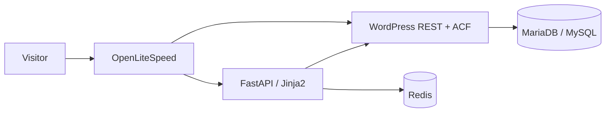

# VeriaGuide

Trilingual tourism guide for **Veria (Veroia)** and the **Imathia** region in northern Greece.

**Live site:** [https://veriaguide.gr](https://veriaguide.gr) · Greek: [/el/](https://veriaguide.gr/el/) · German: [/de/](https://veriaguide.gr/de/)

English uses unprefixed URLs. Greek and German reuse the same templates under `/el/` and `/de/`.

## Features

- Directory listings: churches and monasteries (religious sites), museums, archaeological sites (including the Vergina Royal Tombs), hiking trails, ski resorts, hidden gems, restaurants, cafes, accommodations
- Search (including autocomplete) and interactive maps (Leaflet / OpenStreetMap)
- Favorites, contact form, listing submissions, and contributions (photos, video, descriptions) with admin review
- **AI Guide** (`/ai-guide`, also `/el/ai-guide` and `/de/ai-guide`): wizard that builds a day-by-day itinerary from WordPress listings via Gemini. Off by default (`AI_GUIDE_ENABLED`); disabled routes return 404
- Cookie consent (GDPR) with analytics gated until consent
- SEO: sitemaps, hreflang, localized hub copy, hyphenated public category URLs (`/religious-sites`, `/hiking-trails`, …)
- Redis-backed cache of WordPress REST responses, with optional warming and a WP admin flush plugin

## Tech stack

| Layer | What |
| --- | --- |
| Frontend | FastAPI, Jinja2, Uvicorn (dev) / Gunicorn + Uvicorn workers (prod image) |
| Content | Headless WordPress + ACF, consumed via the REST API (`/wp-json/wp/v2`) |
| Cache | Redis |
| Maps | Leaflet + OpenStreetMap in the public UI; `GOOGLE_MAPS_API_KEY` is still used for ACF map fields in WordPress |
| AI Guide | Google Gemini (`GOOGLE_API_KEY`) |
| Local full stack | Docker Compose: MariaDB, WordPress, Redis, FastAPI |
| Production | FastAPI + Redis in Docker (`docker-compose.vps.yml`); WordPress on the host behind **OpenLiteSpeed** as reverse proxy |



Locally, Compose can run WordPress in Docker as well (`docker-compose.yml`). Production keeps WordPress native and proxies the Python app.

## Project structure

```
.
├── frontend/                 # FastAPI app
│   ├── main.py               # Routes
│   ├── app/                  # Config, WP client, services, i18n, middleware, AI Guide
│   ├── templates/            # Jinja2 templates
│   ├── static/               # CSS, JS, images
│   ├── tests/                # pytest
│   ├── Dockerfile            # Dev image (uvicorn)
│   └── Dockerfile.production # Prod image (gunicorn)
├── wordpress/                # CPT plugin, Redis flush plugin, WP helper scripts
├── docs/                     # Extra guides (deploy, cache, contributions, env)
├── data/                     # Import CSVs and related data
├── docker-compose.yml        # Local: DB + WordPress + Redis + frontend
├── docker-compose.dev.yml    # Dev overrides (HTTP, debug)
├── docker-compose.vps.yml    # Production: frontend + Redis only
└── .env.example              # Env var names (copy to .env; never commit .env)
```

## Local development

**Prerequisites:** Docker and Docker Compose. Python 3.11+ if you run the frontend on the host. A WordPress instance reachable at `WP_API_URL` (Compose starts one on port 8086).

1. Copy environment defaults and fill in local values (placeholders only in git):

   ```bash
   cp .env.example .env
   ```

2. Start the full stack (frontend **http://localhost:8000**, WordPress **http://localhost:8086**, Redis **6379**, MariaDB **3306**):

   ```bash
   ./start-dev.sh
   # same as:
   docker compose -f docker-compose.yml -f docker-compose.dev.yml up --build
   ```

3. Optional: run FastAPI on the host against Docker WordPress/Redis:

   ```bash
   cd frontend
   python -m venv .venv && source .venv/bin/activate
   pip install -r requirements-dev.txt
   uvicorn main:app --reload --host 0.0.0.0 --port 8000
   ```

   Point `WP_API_URL` and `REDIS_URL` in `.env` at those services.

### Tests

From `frontend/` (WordPress is mocked; Redis URL is set to a dummy host in `tests/conftest.py`):

```bash
cd frontend
pip install -r requirements-dev.txt
pytest
```

Lint (optional): `ruff check` using `frontend/ruff.toml`.

## Configuration

Do not commit real secrets. Copy [`.env.example`](.env.example) to `.env`. Production names and notes: [`docs/PRODUCTION_ENV.md`](docs/PRODUCTION_ENV.md).

**Application / WordPress**

| Variable | Role |
| --- | --- |
| `ENVIRONMENT` | `development` / `production` / … |
| `SITE_URL` | Public site URL |
| `ALLOWED_HOSTS` | Comma-separated hosts |
| `WP_API_URL` | WordPress REST base (`…/wp-json/wp/v2`) |
| `WP_API_USERNAME` / `WP_API_PASSWORD` | WP user + **application password** |
| `SECRET_KEY` | Sessions / HMAC |
| `ADMIN_API_KEY` | Admin, cache-warm, AI stats |
| `ENABLE_API_DOCS` | OpenAPI `/docs` (off in production compose) |

**Cache & HTTP**

| Variable | Role |
| --- | --- |
| `REDIS_URL` | Redis connection |
| `REDIS_DEFAULT_TTL` / `CACHE_EXPIRY` | Cache TTLs (seconds) |
| `WORKERS` / `HTTP_TIMEOUT` / `WP_API_TIMEOUT` | Process and HTTP timeouts |
| `HTTP_POOL_CONNECTIONS` / `HTTP_POOL_MAXSIZE` | httpx pool |
| `LOG_LEVEL` | Logging |
| `ITEMS_PER_PAGE` | Listing pagination |

**Maps & AI Guide**

| Variable | Role |
| --- | --- |
| `GOOGLE_MAPS_API_KEY` | ACF / WordPress maps (restrict by HTTP referrer) |
| `GOOGLE_API_KEY` | Gemini (required if AI Guide is on) |
| `AI_GUIDE_ENABLED` | Mount AI Guide routes |
| `AI_GUIDE_MODEL` / `AI_GUIDE_MAX_VENUES` / `AI_GUIDE_MAX_TOKENS` / `AI_GUIDE_TIMEOUT` / `AI_GUIDE_RATE_LIMIT` | Model, retrieval cap, tokens, timeout, per-IP hourly limit |

**Local Compose ports:** `WP_PORT`, `REDIS_PORT`, `FRONTEND_PORT`.  
**Legacy full-stack DB (not used by `docker-compose.vps.yml`):** `MYSQL_*`, `DB_*`.

Optional local deploy-script keys (`SSH_HOST`, `WP_DOCUMENT_ROOT`, …) are commented in `.env.example`; keep them out of the repo.

## Internationalization

- Languages: `en` (default), `el` (`/el/…`), `de` (`/de/…`). `LocaleMiddleware` strips the prefix and sets the language; English routes stay as they are.
- **UI strings** go through the Jinja filter `|t` (`templates.env.filters["t"]` → `translate` in `frontend/app/i18n.py`). English is the source key; Greek lives in `UI_EL` in `i18n.py`; German in `frontend/app/i18n_de.py`.
- **Post body** is not translated in Python. WordPress meta (`title_el` / `title_de`, excerpt, content) is applied in the API layer.
- Unprefixed paths (`/static/`, `/api/`, `/admin`, `/health`, `/sitemap`, …) do not get a language prefix.
- AI Guide has its own translation tables under `frontend/app/ai_guide/`.

## Deployment (overview)

Production runs **FastAPI + Redis** with `docker-compose.vps.yml` and an `env_file: .env` that exists **only on the server**. WordPress runs on the host (CyberPanel / OpenLiteSpeed). OLS reverse-proxies public traffic to the frontend container (bound on loopback) and serves WordPress for `/wp-json` and the admin.

Typical flow: sync application files, `docker compose -f docker-compose.vps.yml up -d --build`, then flush Redis if listings look stale. Details and OLS rewrite notes live in `docs/` (`PRODUCTION_ENV.md`, `DEPLOYMENT.md`, `OLS_TRAILING_SLASH.md`). Do not put hosts, IPs, or document-root paths in git.

Cache: `docker exec veriaguide_redis redis-cli FLUSHALL`, or **Tools → Redis cache** after installing `wordpress/plugins/veriaguide-redis-flush`.

## Contributing

1. Use a feature branch; keep secrets and `.env` out of commits.
2. Prefer small, focused changes to `frontend/` with matching tests under `frontend/tests/`.
3. Run `pytest` from `frontend/` before opening a PR.
4. For UI copy, add English source strings and `|t`, then entries in `UI_EL` and `i18n_de.py`.
5. User-facing contribution/submit flows: `docs/CONTRIBUTIONS_GUIDE.md`, `docs/USER_SUBMISSIONS.md`.

## License

No `LICENSE` file is in this repository yet. Licensing is **TBD**.
